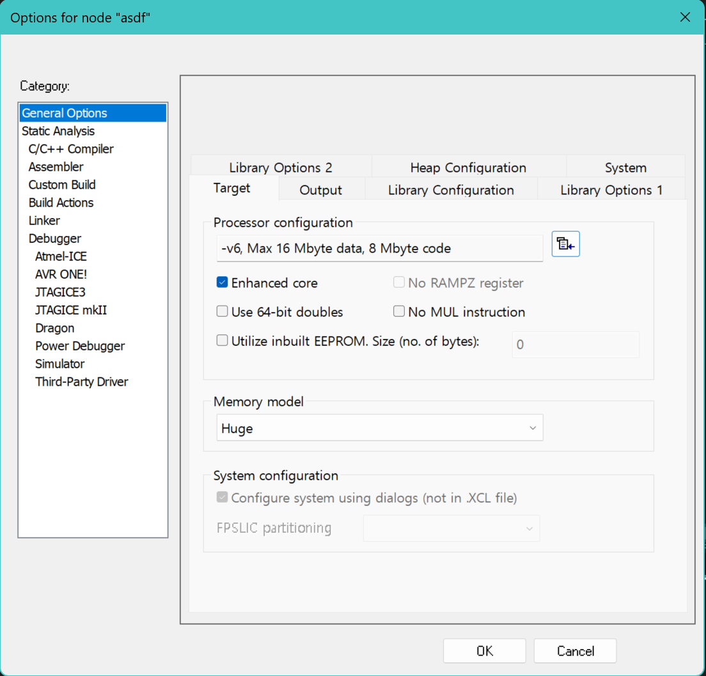
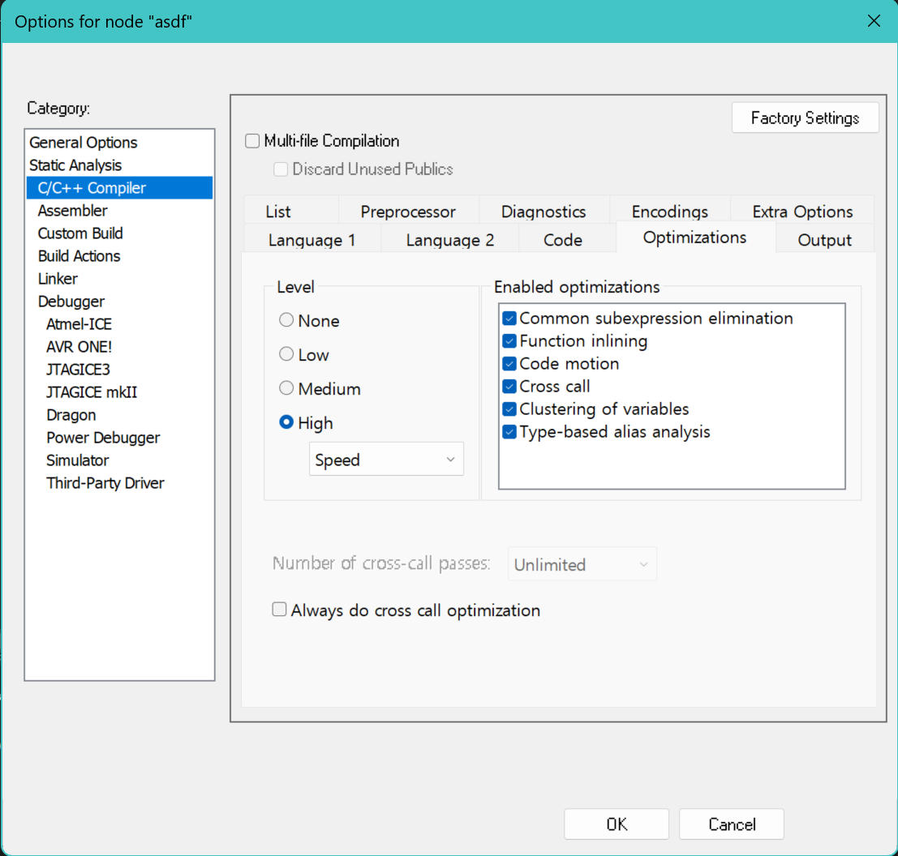
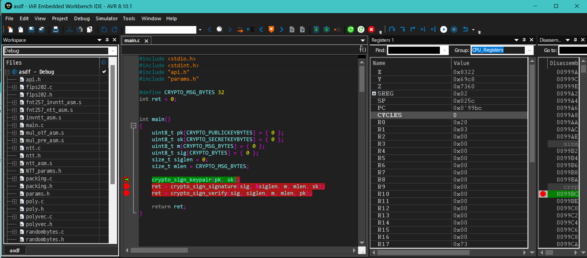
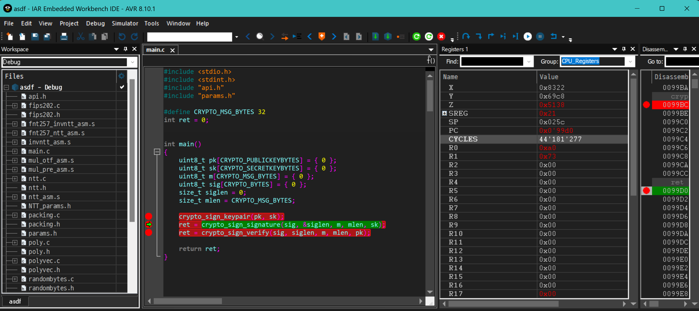

This file documents how to reproduce the numbers in our paper.
Inside the two folders `code_kem` and `code_sign`,
the environment setup and the usage of the scripts are the same.
The only different is the target cryptographic schemes and the benchmarking policies (KEMs vs signatures).

After going to each folders `code_kem` and `code_sign`, follow the instructions below.

# Requirements

- [IAR Embedded Workbench for AVR](https://www.iar.com/ko/products/architectures/microchip/iar-embedded-workbench-for-avr/) :
We developed our AVR code in IAR Embedded Workbench AVR.
  - One can get a one week trial to run the artifact at the link.
  - [IAR Embedded Workbench for AVR] is Windows (544.5MB) only software.
    
# How to Run
- run IAR Workbench and create a new workspace.
- click `Project` tap and creat new project. For project templates, select `main` in the `C` folder.
- delete `main.c`
- please add code files, including `main.c` (For example, add all the files in the dilithium2/avrBarrett folder)
- Right-click your project and click `Options`.
- General Options -> Target -> Processor configuration -> Generic Device -> `-v6, Max 16 Mbyte data, 8Mbyte code`
- General Options -> Target -> Memory model -> `Huge`
- please refer `img/generic.png` file

- C/C++ Compiler -> Optimizations -> `High` (Speed, pls enable all optimizaiton option)
- please refer `img/speed.png` file

- take a breakpoint each API (ex. crypto_sign_keypair, crypto_sign_signature, crypto_sign_verify)
- make (F7) and run (Ctrl+).
- if add a Register in the View Tap, one can see the Cycles. Before measuring Cycles for each API, make Count in register zero.
- please refer `img/before.png` and  `img/after.png` file

- Other AVR code can be built and run in the same way as above.
